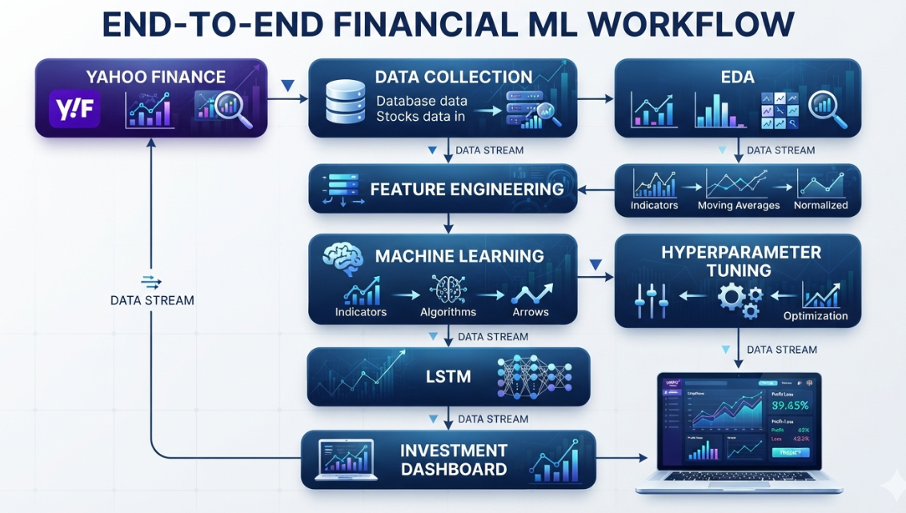
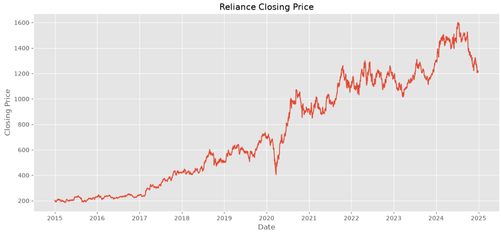
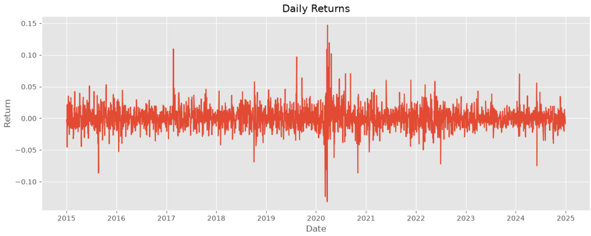
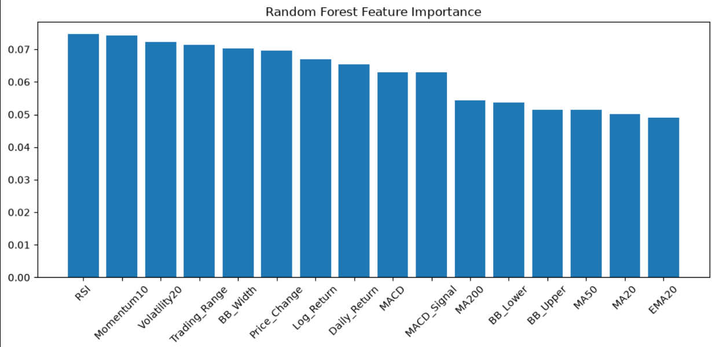
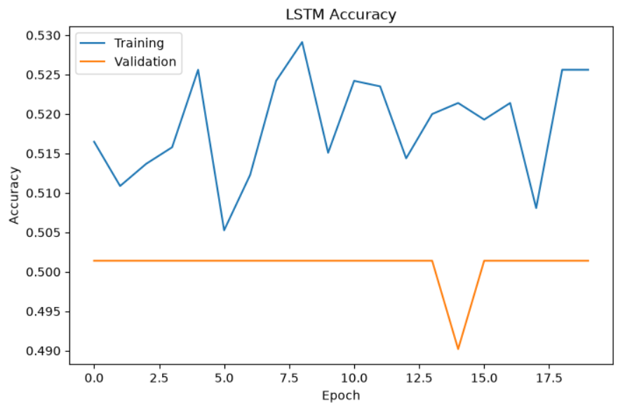
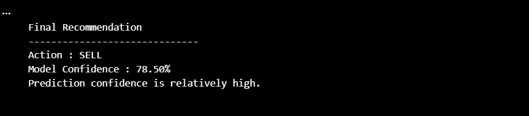

# 📈 AI Investment Decision Support System

An end-to-end Machine Learning and Deep Learning project that analyzes historical stock market data, engineers technical indicators, trains predictive models, and generates AI-powered investment recommendations.

---

## 📑 Table of Contents

- [Project Overview](#-project-overview)
- [Project Screenshots](#-project-screenshots)
- [Project Structure](#-project-structure)
- [Dataset](#-dataset)
- [Feature Engineering](#️-feature-engineering)
- [Machine Learning Models](#-machine-learning-models)
- [Model Validation](#-model-validation)
- [Model Performance](#-model-performance)
- [Hyperparameter Tuning](#-hyperparameter-tuning)
- [Model Explainability](#-model-explainability)
- [Deep Learning](#-deep-learning)
- [Investment Decision Dashboard](#-investment-decision-dashboard)
- [Technologies Used](#️-technologies-used)
- [Getting Started](#-getting-started)
- [Future Improvements](#-future-improvements)
- [Key Learnings](#-key-learnings)
- [Disclaimer](#-disclaimer)
- [Author](#-author)

---

# 🚀 Project Overview

This project builds an AI-powered investment decision support system using historical stock market data.

The complete workflow includes:

- 📥 Stock Data Collection
- 📊 Exploratory Data Analysis (EDA)
- ⚙️ Feature Engineering
- 🤖 Machine Learning Baseline Models
- 📈 Model Comparison
- 🧠 Advanced Feature Engineering
- 🎯 Hyperparameter Tuning
- 🔍 Model Explainability
- 🧠 Deep Learning using LSTM
- 📋 Investment Decision Dashboard

The objective is to predict the next trading day's stock price direction and provide a Buy/Sell recommendation based on machine learning models and technical indicators.

---

# 📸 Project Screenshots

## Project Workflow



---

## Historical Stock Price



---

## Correlation Heatmap



---

## Random Forest Feature Importance



---

## LSTM Training Accuracy



---

## Investment Decision Dashboard



---

# ⭐ Key Features

- Historical stock data collection using Yahoo Finance
- Exploratory Data Analysis (EDA)
- Technical indicator generation
- Machine learning model comparison
- TimeSeriesSplit validation
- Random Forest hyperparameter tuning
- SHAP model explainability
- LSTM deep learning implementation
- AI-powered investment recommendation dashboard

---

# 📂 Project Structure

AI-Investment-Decision-Support/
│
├── data/
│   ├── raw/
│   └── processed/
│
├── notebooks/
│   ├── 01_stock_data_download.ipynb
│   ├── 02_exploratory_data_analysis.ipynb
│   ├── 03_feature_engineering.ipynb
│   ├── 04_machine_learning_baseline.ipynb
│   ├── 05_model_improvement.ipynb
│   ├── 06_advanced_feature_engineering.ipynb
│   ├── 07_hyperparameter_tuning.ipynb
│   ├── 08_model_explainability.ipynb
│   ├── 09_lstm_stock_prediction.ipynb
│   └── 10_investment_decision_dashboard.ipynb
│
├── images/
├── src/
├── requirements.txt
├── README.md
└── .gitignore
```

---

# 📊 Dataset

**Source:** Yahoo Finance

**Stock:** Reliance Industries Ltd. (`RELIANCE.NS`)

The dataset contains:

- Open
- High
- Low
- Close
- Adjusted Close
- Volume

---

# ⚙️ Feature Engineering

### Basic Features

- Daily Return
- Log Return
- Trading Range
- Price Change
- Moving Average (20)
- Moving Average (50)
- Moving Average (200)
- Exponential Moving Average (20)
- Rolling Volatility

### Advanced Technical Indicators

- Relative Strength Index (RSI)
- MACD
- MACD Signal
- Bollinger Bands
- Bollinger Band Width
- Momentum (10)

---

# 🤖 Machine Learning Models

The following algorithms were implemented and evaluated:

- Logistic Regression
- Decision Tree
- Random Forest
- LSTM Neural Network

---

# ✅ Model Validation

Instead of a random train-test split, this project uses:

**TimeSeriesSplit**

This validation strategy preserves chronological order and helps prevent data leakage when working with time-series data.

---

# 📈 Model Performance

| Model               | Average Accuracy |
|----------------------------------------|
| Random Forest       |      ~50%        |
| Logistic Regression |      ~50%        |
| Decision Tree       |      ~49%        |

### Key Finding

Changing the machine learning algorithm alone did not significantly improve predictive performance.

This indicates that **feature engineering has a greater impact than model complexity** for this dataset.

---

# 🎯 Hyperparameter Tuning

Random Forest was optimized using:

- GridSearchCV
- TimeSeriesSplit
- Cross Validation

### Best Parameters

```
n_estimators      = 200
max_depth         = None
min_samples_split = 2
```

---

# 🔍 Model Explainability

The project includes:

- Random Forest Feature Importance
- SHAP (SHapley Additive Explanations)

These techniques improve transparency by explaining which features contributed most to the model's predictions.

---

# 🧠 Deep Learning

An LSTM Neural Network was implemented to evaluate whether sequential learning improves stock direction prediction compared with traditional machine learning models.

---

# 📋 Investment Decision Dashboard

The final notebook generates an AI-powered dashboard capable of displaying:

- Buy / Sell Recommendation
- Model Confidence
- Technical Indicators
- Market Interpretation

This demonstrates how machine learning predictions can be translated into practical investment insights.

---

# 🛠️ Technologies Used

- Python
- Pandas
- NumPy
- Matplotlib
- Scikit-learn
- TensorFlow / Keras
- SHAP
- Jupyter Notebook
- Git
- GitHub

---

# 🚀 Getting Started

### Clone the repository

```bash
git clone https://github.com/Vinoth-Ganesamurthy/AI-Investment-Decision-Support.git
```

### Navigate to the project

```bash
cd AI-Investment-Decision-Support
```

### Install dependencies

```bash
pip install -r requirements.txt
```

### Launch Jupyter Notebook

```bash
jupyter notebook
```

---

# 📖 Key Learnings

Through this project, I gained hands-on experience in:

- End-to-end Machine Learning workflows
- Time-series data analysis
- Technical indicator engineering
- Hyperparameter tuning using GridSearchCV
- Model interpretability using SHAP
- Building LSTM models for financial forecasting
- Git and GitHub version control
- Presenting machine learning results through an investment dashboard

---

# 🚀 Future Improvements

Potential enhancements include:

- Live stock market data integration
- Streamlit web application
- Portfolio optimization
- Financial news sentiment analysis
- Transformer-based forecasting models
- Real-time investment dashboard

---

# ⚠️ Disclaimer

This project is intended for educational and research purposes only.

The predictions generated by the models should **not** be considered financial or investment advice.

---

# 👨‍💻 Author

**Vinoth Ganesamurthy**

**GitHub**

https://github.com/Vinoth-Ganesamurthy

**LinkedIn**

https://www.linkedin.com/in/vinoth-ganesamurthy/

---

⭐ **If you found this project useful, consider giving it a star!**